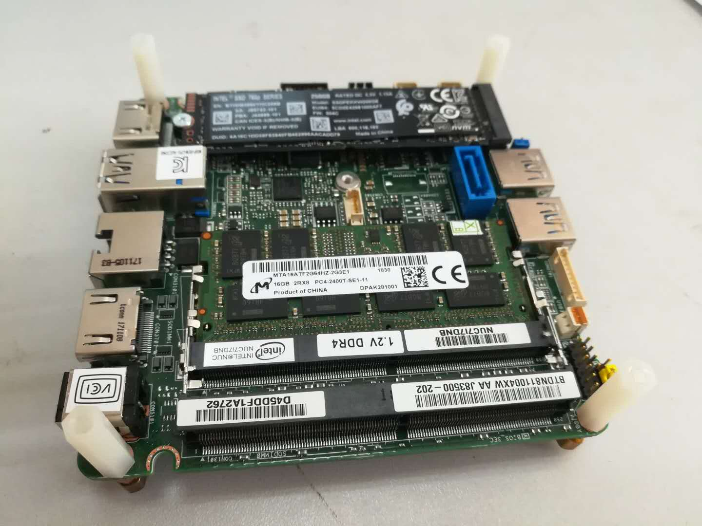
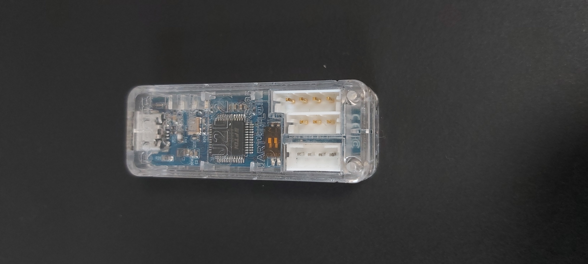
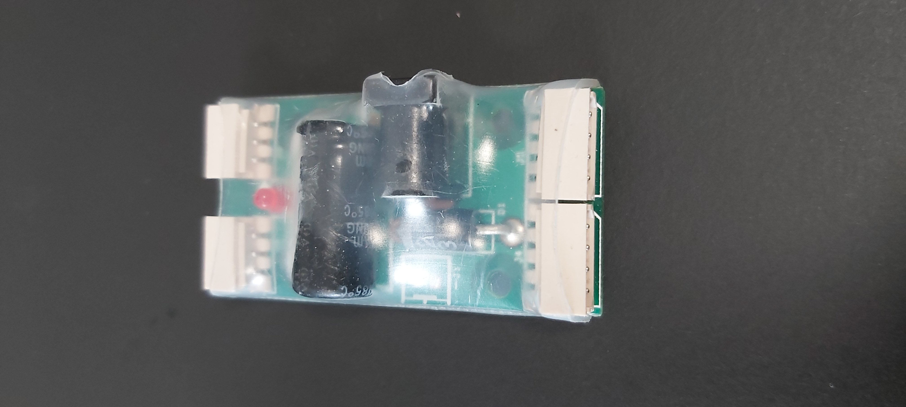
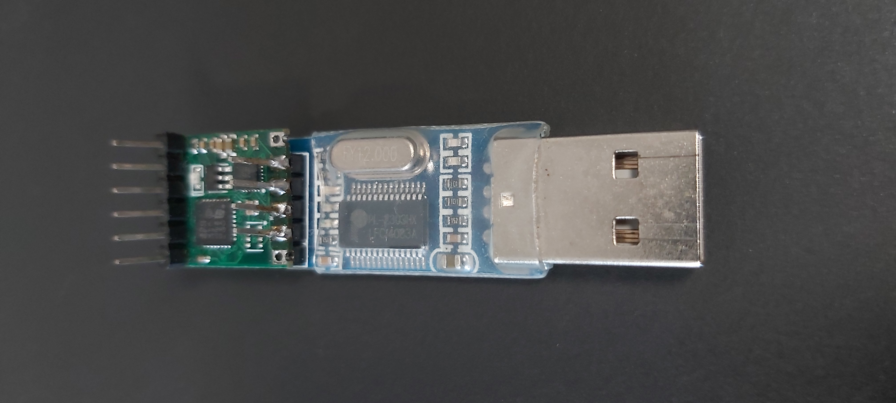

# Lilibot

- [Introduction](#Introduction)
- [Hardware](#Hardware)
- [Install](#Install)
- [Getting started](#Getting start)
- [Contact](#Contact)
- [Citation](#Citation)

## Introduction

Lilibot is a small size, light weight, and  open-sourced quadruped robot. It was developed as a easily handling platform with multiple sensory feedback and flexible legs configurations for studying bio-inspired locomotion. The features of small size and light weight provide Lilibot with several apparent advantages, such as an easily modular design, and simple yet practical structure. It can be handled with ease to conduct joint control and locomotion generation, owing to its appropriate 1) actuator torque (4.2 Nm, which is not dangerous to handlers), 2) size (its length, width, and height are 30 cm, 17.5 cm, and 20 cm, respectively, when it stands), and 3) weight (2.5 kg) for operation. Moreover, it has considerable endurance capability, which allows it to handle an approximately 1.25 kg payload to walk up to 30 minutes. This enables Lilibot as a mobile platform to carry more sensors (for instance, cameras and laser radars for studying motion planning in irregular environments). In addition to the real robot, the compatible Lilibot simulator can improve the research efficiency by using simulation for pre-tests before doing experiments.

This repository includes the Lilibot CAD models, simulator on the virtual robot experimentation platform (V-REP, the new version of the V-REP is called CoppeliaSim at http://www.coppeliarobotics.com/) and its control framework. The control framework is based on the robot system operation (ROS), which provides communications between the real robot, controller, and the simulator (simulated robot). Thus, before one use this system, who need to install V-rep or CoppeliaSim and ROS on Ubuntu 16.04 or 18.04. 

### Framework

The files are organized as follows:
 
The control code is putted in controllers folder,and the robots folder is the interface code for a real robot. The Vrep simulation model was put in vrep_simulation folder. The mechanics and electronics can be found in hardware

The system overview can be seen in the following image.

# Hardware
The hardware overview can be seen in [here](https://gitlab.com/neutron-nuaa/lilibot/-/tree/master/hardware). The main components are as bellows:

## Electronics
| Onboard computer  | Motor communication board| Power supply board| IMU with USB2USART|
| ----------------- | ------------ |--------------- |
| |   |   |  |

## Mechanics

| Quadruped 8dof  | Quadruped 12dof | Biped 6dof | TriFingerEdu |
| ---------------  | ------------- |------------- |------------- |
| |   |  |     |

# Install
The steps to implement this project on your PC (Ubuntu OS):

3.0) Install VREP

3.1) Install ROS kinetic or melodic depending on the version of your ubuntu 

3.2) Install git

3.3) 'mkdir -p ~/workspace/stbot/ && cd ~/workspace/stbot/'

3.4) 'git clone https://gitlab.com/neutron-nuaa/lilibot'

3.5) 'cd ./lilibot/catkin_ws && catkin_make'

3.5) add a environment variable in your ~/.bashrc or ~/.zshrc, like this:
    'export ROS_HOSTNAME=$(hostname)'

3.6) Run simularion, 
    a) 'roscore'
    b) 'cd vrep_simualtion && vrep ~/workspace/stbot/vrep_simulation/lilibot-V5.ttt'

# Getting start

Just edit the file of lilibot_controller_node.cpp
you can find this file at controller/catkin_ws/src/lilibot_controller/src/lilibot_controller_node.cpp

# Video demos

- http://manoonpong.com/Lilibot/video0.mp4
- http://manoonpong.com/Lilibot/video1.mp4
- http://manoonpong.com/Lilibot/video2.mp4
- http://manoonpong.com/Lilibot/video3.mp4
- http://manoonpong.com/Lilibot/video4.mp4
- http://manoonpong.com/Lilibot/video5.mp4
- http://manoonpong.com/Lilibot/video6.mp4

- http://www.manoonpong.com/AdaptiveCommunications/video4.mp4

# Contact

If you have any question about how to use this, please feel free to contact Tao Sun (email: suntao.hn@gmail.com, or write a issue)

# Citation

@article{sun2020small,
  title={Small-Sized Reconfigurable Quadruped Robot With Multiple Sensory Feedback for Studying Adaptive and Versatile Behaviors},
  author={Sun, Tao and Xiong, Xiaofeng and Dai, Zhendong and Manoonpong, Poramate},
  journal={Frontiers in Neurorobotics},
  volume={14},
  year={2020},
  publisher={Frontiers Media SA}
}
